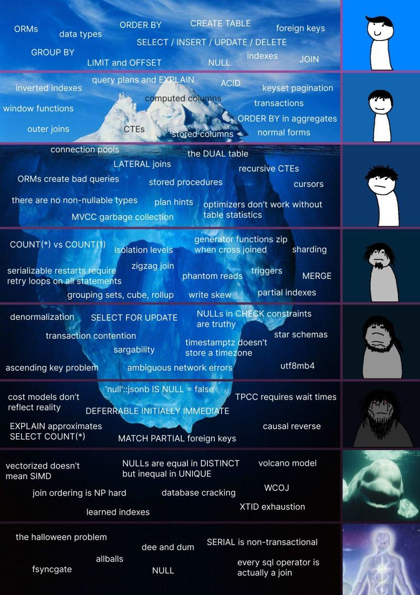

# SQL-learning

## [Day 01](Day%01)

* Basic SQL Concepts
*  What is a Relational Database / RDBMS?
*  What is a schema wrt to a relational database?
*  How data is stored in a relational database?
*  Data Types
*  String data type like VARCHAR and CHAR
*  DATE, DATE TIME, TIMESTAMP

SQL commands
DDL, DML, DCL, TCL, DQL

What are commands under each of these category and what each of these commands actually do?

Data Types
String data type like VARCHAR, TEXT etc

Integer data type like INT, NUMBER etc.

DATE

FLOAT / DECIMAL

BOOLEAN

Also check out IDENTITY column (Auto Increment column)

Constraints
Primary key

Foreign key

Check constraint, Not null constraint, Unique constraint, Default etc.

Normalization in SQL
Different normal forms like 1NF, 2NF, 3NF, BCNF

Operators
Arithmetic operator

Logical operator

Comparison operator

UNION, UNION ALL operator

CASE statement
Simple case statement as well nested case statement.

Important SQL clause
DISTINCT clause

Order by clause

Limit / Top clause

INNER join
How to fetch data from multiple tables.

Intermediate SQL
Concepts
Group By and Having clause
Aggregate functions
Order of Execution
Sub-Queries
CTE table / WITH clause
All type of Joins
LEFT Join, RIGHT Join, FULL OUTER Join

CROSS Join, SELF Join

In-built functions
String functions like Substring, Position, Coalesce etc.

Date functions like Extract, To_Date etc.

Window functions
Most important are RANK, DENSE_RANK, ROW_NUMBER, LEAD, LAG

Also good to learn FIRST_VALUE, LAST_VALUE, NTH_VALUE, NTILE

Views

In-built functions
String Functions:
Date functions:

Advance SQL
Concepts
Recursive SQL Queries
PIVOT table / CROSSTAB function
Materialized Views
Stored Procedure
User Defined Functions

Indexes
Triggers
Temporary tables
Dynamic Execution of SQL statements
PL/SQL concepts
Variables

Cursors

Collection types

Loop statements

IF Else statement

Exception Handling

Packages

Performance tuning
Explain plan

Table Statistics

Table Partitioning

DBMS_Profiler

SQL Trace and TKProf

